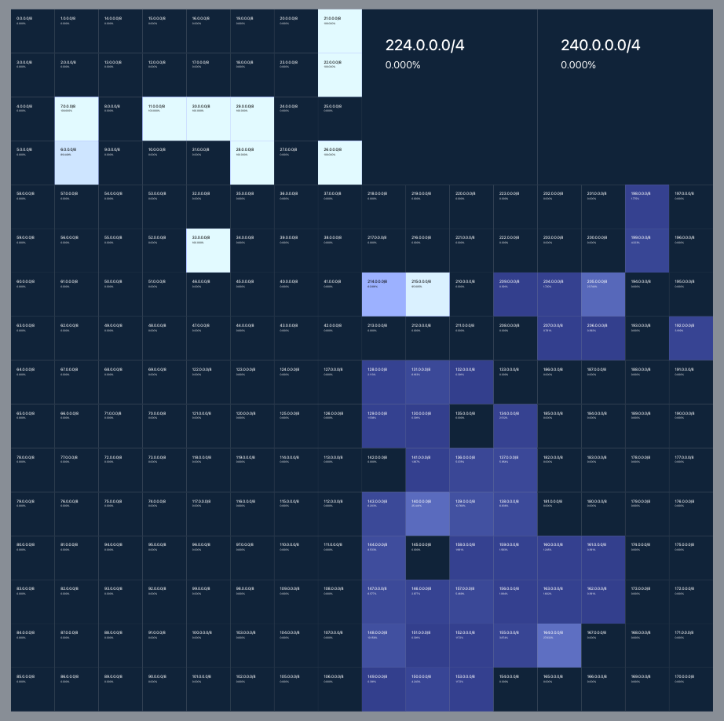

# Hilby - Hilbert Interactive Prefix Plots

A React component for rendering interactive Hilbert curve visualizations. This component provides a flexible and customizable way to visualize hierarchical data using Hilbert curve space-filling patterns.

#### [Demo](https://netd-tud.github.io/hilby/)

<p align="center">
  
</p>

## Features

- **Interactive**: Fast pan and zoom functionality out of the box!
- **Easily customizable**: Define functions that decide how each subnet looks!
- **Split/merge functionality**: Visualize large areas of IP space with the right amount of detail!
- **IPv6 ready**: Supports both IPv4 and IPv6 ranges!
- **Hover interactions**: Use the hover position to build truly interactive UIs!
- **TypeScript support**: Types are shipped out of the box!
- **Some batteries included**: Basic functions for visualization and key control are provided out of the box!

## Installation

```bash
npm install @netd-tud/hilby
```
## Basic Usage

```tsx
import { InteractiveHilbert } from '@netd-tud/hilby';

const renderFunctions = [
    (prefix, long, netmask, config) => {
        config.innerContent.push(<div>{prefix}</div>);
    }
];

function App() {
    return (
        <InteractiveHilbert 
            topPrefix="0.0.0.0/0"
            renderFunctions={renderFunctions}
        />
    );
}
```

## Getting started

The `InteractiveHilbert` component is at the core of this project. It requires the highest prefix that should be visualized (in this case 1.0.0.0/8).

```tsx
import { InteractiveHilbert } from '@netd-tud/hilby';

// Example function, just to display something in each subnet
const renderFunctions = [
    (prefix, long, netmask, config) => {
        config.innerContent.push(<div>{prefix}</div>);
    }
];

function App() {
    return (
        <InteractiveHilbert 
            topPrefix="1.0.0.0/8"
            renderFunctions={renderFunctions}
        />
    );
}
```
To change the looks and content of a subnet, an array of render functions can be provided.

```tsx
import { InteractiveHilbert } from '@netd-tud/hilby';

const renderFunctions = [
    (prefix, long, netmask, config) => {
        config.innerContent.push(<div>{prefix}</div>);
    }
];

function App() {
    return (
        <InteractiveHilbert 
            topPrefix="1.0.0.0/8"
            renderFunctions={renderFunctions}
        />
    );
}
```


Whenever a subnet is rendered within the Hilbert Curve (this also applies to the top prefix), the functions provided via `renderFunctions` are executed in sequence.
A render functions receives 4 parameters:
1. `prefix`: `string` This is the CIDR Notation of the subnet being rendered (i.e. "1.0.0.0/8").
2. `long`: `bigint` This is the network address in long, network-order format (i.e. 0x01000000 for an IPv4 address).
3. `netmask`: `number` This is the length of the network mask for the subnet being rendered (i.e. 8).
4. `config`: `SubnetConfig` This is the object that controls how the subnet is rendered in the HilbertCurve.

The first three parameters are provided for identification and convenience, while the main control is exposed via the `config` object.

```typescript
interface SubnetConfig {
    style: CSSProperties;
    innerContent: ReactNode[];
    properties: Record<string, any>;
}
```


#### `style`
The CSS properties set in `style` will be directly applied to the rendered subnet and can be used to customize their look.

Example: 

```tsx
// Change the color of the subnet square to red if its more specific than a /24
const colorSmallSubnetsRed: RenderFunction = (prefix, long, netmask, config) => {
    if (netmask > 24) {
        config.style.backgroundColor = "rgb(255, 0, 0)";
    }
}
```

#### `innerContent`
ReactNodes added to the `innerContent` property will be rendered **inside** the subnet square (if the subnet is not split). This can be useful to add information to a subnet that should be visible at a glance. 

Example: 

```tsx
// Add the subnet name as a string to the body of the subnet square
const addSubnetName: RenderFunction = (prefix, long, netmask, config) => {
    config.innerContent.push(<div>{prefix}</div>);
}
```


#### `properties`

The `properties` object allows for user-defined data to be attached to a subnet. This together with the sequential execution order of render functions allows for conditional or more complex functionality.

Example: 

```tsx
// Get the packet count received by a subnet
const addPacketCount: RenderFunction = (prefix, long, netmask, config) => {
    const receivedPacketCount = getPacketCountFromExternalDataSource(prefix);
    config.properties["packet_count"] = receivedPacketCount;
}

// Add packet count as string to the body of the subnet square
const showPacketCount: RenderFunction = (prefix, long, netmask, config) => {
    config.innerContent.push(<div>{config.properties["packet_count"]} packets</div>);
}

// Color subnets with high traffic red
const colorHighPacketCount: RenderFunction = (prefix, long, netmask, config) => {
    if (config.properties["packet_count"] > 1000) {
        config.style.backgroundColor = "rgb(255, 0, 0)";
    }
}

// Set default render functions
const renderFunctions = [addPacketCount, showPacketCount];

// Render functions can be added and removed dynamically 
if (showHighPacketFilter) {
    // This will cause a rerender of all visible subnets.
    renderFunctions.push(colorHighPacketCount);
}
```

**Render functions need to have stable references**, meaning they should either be created outside of a React component or wrapped with the `useCallback` react hook. 

The result of the render function sequence is memoized at subnet level to save on render time. 

## Controlling the Hilbert curve by Code

By default, the expansion and interaction with the Hilbert Curve is only done by the user. For more interactive websites, it might be useful to perform certain actions on the Curve from code. For this the `useControlledHilbert` hook is provided.

### Basic usage

The `useControlledHilbert` hook returns three values:
1. `hilbertStore` has to be passed to the `InteractiveHilbert` component that should be controlled.
2. `prefixStateManipulation` contains a collection of functions through which single prefixes can be manipulated.
3. `zoomManipulation` contains a collection of functions through which the "camera position" can be manipulated. 
4. `useHoveredPrefix` is a hook that can be used to extract the currently hovered prefix.


```tsx
function App() {
    
    const [hilbertStore, prefixStateManipulation, zoomManipulation, useHoveredPrefix] = useControlledHilbert();

    return (
        <InteractiveHilbert 
            topPrefix="0.0.0.0/0"
            renderFunctions={renderFunctions}
            hilbertStore={hilbertStore}
        />
    );
}
```

### Prefix manipulation

A set of functions is exposed via the `prefixStateManipulation` return value.

#### 1. `setPrefixConfig`

```tsx
setPrefixConfig: (prefix: string, state: Partial<SubnetConfig>, merge: boolean = true) => void;
```

This function allow the developer to overwrite the `SubnetConfig` for a specific subnet. 

The `merge` parameter controls whether changes should be merged with the results of the render function execution or override the entire configuration.


#### 2. `clearPrefixState`

```tsx
clearPrefixState: (prefix: string) => void;
```

This function resets all settings set by `setPrefixConfig`.

#### 3. `clearAllPrefixes`

```tsx
clearAllPrefixes: () => void;
```

`clearPrefixState` but for all prefixes. 


#### 4. `setPrefixSplit`

```tsx
setPrefixSplit: (prefix: string | string[], split: boolean | null) => void;
```

This function performs the same action as a left-click by a user, splitting the subnet (or mulitple, if an array is passed) into its 4 subnets.
The action set with the `split` parameter will be applied **once** and force a rerender of the subnet if its currently visible. 
If its not visible, the action is stored until the subnet gets into view. (This means that a prefix can be "presplit".)

By passing `null`, any currently stored setting is cleared. 

### zoomManipulation

#### 1. `resetZoom`

```tsx
resetZoom: () => void;
```

This function resets the zoom and position of the camera in the HilbertCurve back to the default (TopPrefix at 80% Zoom).

#### 2. `zoomToPrefix`

```tsx
zoomToPrefix: (prefix: string) => boolean;
```

This function sets the camera to `prefix` at 80% zoom. It splits all prefixes required to have the target prefix visible.
It returns a boolean indicating whether it could successfully parse the subnet provided via `prefix` and some sanity checks
such as matching AF and if it's a subnet of the topPrefix were successful.

### Hovering

```tsx
useHoveredPrefix: () => {prefix: string, config: SubnetConfig}
```

The currently hovered over prefix can be accessed by the `useHoveredPrefix` hook returned from `useControlledHilbert`.
This hook causes a rerender of its component, if the hovered over prefix changes.

Example:

```ts
interface HoverInfoProps {
    getHoveredPrefix: () => HoverPrefix;
}

const HoverInfo = (props: HoverInfoProps) => {

    const hoverPref = props.getHoveredPrefix();
    
    return (
        <div>
            <h2>{hoverPref.prefix}</h2>
            {/*
                Using a config.property here that contains ReactNodes, 
                to store data for the tooltip panel with the prefix 
                and created by the render functions.
            */}
            <div>{hoverPref.config.properties.tooltipContent}</div>

        </div>
    )
}
```
## Helper functions

The library provides some helper functions to allow for easier and faster development/visualization cycles.

### `useEnableKeyBindings`

This hook allows a user to "expand" in and out of a prefix by changing the `topPrefix` of the HilbertCurve. It can be used to reduce clutter, if only a certain prefix is of interest.

It requires a controlled Hilbert Curve and takes the corresponding `HilbertStoreInstance` as the first parameter. Additional settings can be set via the `KeyBindingsSettings` object.
`originalTopPrefix` will probably take the value of the largest available prefix. `minLevel` and `maxLevel` allow to limit how far in and out a user can expand (defaulting to `0` and MAX_NUMBER_OF_BITS for the `originalTopPrefix` respectively). The hotkeys for expanding in and out can be set via `zoomInKey` (default: `e`) and `zoomOutKey` (default: `q`).

The hook returns a state variable that should be passed to `topPrefix` of the HilbertCurve and a setter to update that state externally (just like `useState`). Additionally it returns a keyHandler function which should be bound to the top component from which keycontrol is desired.

```ts
type KeyBindingsSettings = {
    originalTopPrefix: string;
    minLevel?: number;
    maxLevel?: number;
    zoomInKey?: string;
    zoomOutKey?: string;
}

type useEnableKeyBindings = (hilbertStore: HilbertStoreInstance, settings: KeyBindingsSettings) => [string, (newPrefix: string) => void, (React.KeyboardEvent) => void];
```

Example:
```tsx
function App() {

    const [hilbertStore, prefixStateManipulation, useHoveredPrefix] = useControlledHilbert()  
    const [topPrefix, setTopPrefix, keyHandler] = useEnableKeyBindings(hilbertStore, {originalTopPrefix: "1.0.0.0/8", minLevel: 8, maxLevel: 32, zoomInKey: "e", zoomOutKey: "q"});

    return (
        <div onKeyUp={keyHandler} tabIndex={0}>
            <InteractiveHilbert topPrefix={topPrefix} hilbertStore={hilbertStore}/>
        </div>
        )
}
```

### `basicColorRendering`

```ts
const basicColorRendering: (colorProperty: string, minValue: number, maxValue: number) => RenderFunction
```

This renderFunction factory creates a RenderFunction which colors prefix squares with a linear color gradient based on a developer supplied value.
`colorProperty` is the key in `config.properties` of each subnet where the value to color by is stored.
`minValue` and `maxValue` are the min and max possible values, to allow for color calculation.

Example:
```tsx
const addPacketCount: RenderFunction = (prefix, long, netmask, config) => {
    // Fetch packet counts for each prefix from a datasource
    const receivedPacketCount = getPacketCountFromExternalDataSource(prefix);
    config.properties["packet_count"] = receivedPacketCount;
}

// getMinPacketCount and getMaxPacketCount pull the respective value from a datasource
const colorPrefixes = basicColorRendering("packet_count", getMinPacketCount(), getMaxPacketCount());

const renderFunctions = [addPacketCount, colorPrefixes];

return <InteractiveHilbert topPrefix={"0.0.0.0/0"} renderFunctions={renderFunctions}/>
```


## Performance

### Quick External Data Access
The component is designed with performance in mind. For this reason render function outputs are memoized as much as possible and rerenders are keep to a minimum.

The implementation of the render functions are however of crucial importance to the overall speed of the Curve. Heavy computation, data fetches and complex object accesses in render functions **should be avoided where possible**. This is especially true if large changes are caused at once by the use of the `PrefixStateManipulation` API.
Since IP address space data is one dimensional, [TypedArrays](https://developer.mozilla.org/en-US/docs/Web/JavaScript/Reference/Global_Objects/TypedArray) can be very useful to store large amounts of numeric data in quickly indexable objects. For this reason the integer form of the prefix is passed into the `renderFunction` as well.

### Bigint speeds

To support both IPv4 and IPv6, all addresses are stored in `BigInt`s internally. These are naturally slower than `Number`. For IPv4, optimizations in JS engines seem to keep these differences minimal. For IPv6 however, the speed difference is noticable. Large changes in IPv6 visualizations like splitting >4 layers deep at once should therefore be avoided.  

## Component API

### InteractiveHilbert 

```tsx
<InteractiveHilbert 
    topPrefix="0.0.0.0/0"
    renderFunctions={renderFunctions}
/>
```
#### Props:
- `topPrefix: string` - The root prefix to start rendering from (accepts both IPv4 and IPv6 prefixes)
- `renderFunctions: RenderFunction[]` - Array of functions that customize the rendering of each block
- `hilbertStore?: HilbertStore` - Optional store for controlled curves. Obtain this via `useControlledHilbert`.

### RenderFunction

```typescript
type RenderFunction = (
    prefix: string,
    long: number,
    netmask: number,
    config: SubnetConfig
) => void;
```

### SubnetConfig

```typescript
type SubnetConfig = {
    style: CSSProperties;
    innerContent: ReactNode[];
    properties: Record<string, any>;
}
```

### useControlledHilbert Hook

```typescript
type UseControlledHilbert = () => [
    HilbertStore,
    PrefixStateManipulation,
    ZoomManipulation,
    () => HoverPrefix
];
```

### HoverPrefix

```typescript
type HoverPrefix = {
    prefix: string;
    config: SubnetConfig;
}
```

### PrefixStateManipulation

```typescript
type PrefixStateManipulation = {
    setPrefixConfig: (prefix: string, state: Partial<SubnetConfig>, merge?: boolean) => void;
    clearPrefixState: (prefix: string) => void;
    clearAllPrefixes: () => void;
    setPrefixSplit: (prefix: string, split: boolean | null) => void;
}
```

### ZoomManipulation 

```typescript
type ZoomManipulation = {
    zoomToPrefix: (prefix: string) => boolean;
    resetZoom: () => void;
}
```

## License

MIT

## Author 

Alexander Männel (alexander.maennel@tu-dresden.de)

## Building this repo

- `yarn dev` to run the demo page locally 
- `yarn build` to build the library in `dist/`
- `yarn test` to build the library and run the demo with the new build
- `yarn preview` to create a production build of the demo 

## Acknowledgements
- [wouterraateland/use-pan-and-zoom](https://github.com/wouterraateland/use-pan-and-zoom): Pan and Zoom Functionality (see lib/use-pan-and-zoom)
- [measurement-factory/ipv4-heatmap](https://github.com/measurement-factory/ipv4-heatmap): The original C implementation to create Hilbert Curves; source for the hilbert implementation in this project.